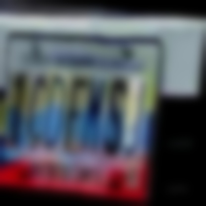
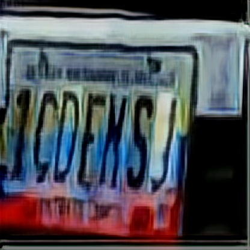
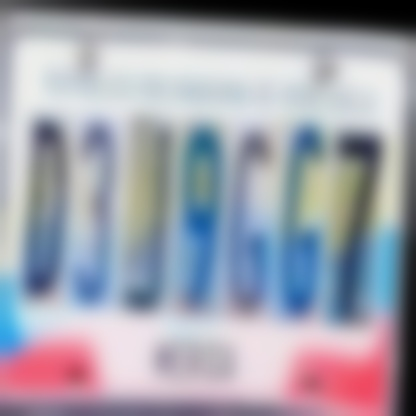
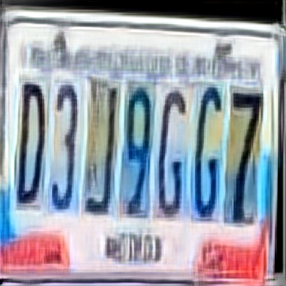
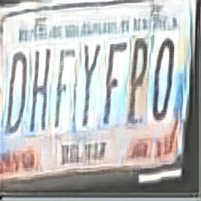

# Using deblurv2 GAN on custom dataset

**Dataset preparation**

You can download any set of images which are text, scenery etc . Using gaussian blur you can blur a copy of the images.
I have took  a dataset from [roboflow](https://universe.roboflow.com/yashwanthworkspace/numbers-identification) .
Made following folders 
```
--Licenseplate_blur_clear_dataset
    --train
        --blur
        --sharp
    --test
        --blur
        --sharp
    --valid
        --blur
        --sharp
```
Copy original images of train,test,valid to sharp folder. To fill the images in blur folder you can use [this code](./util/blur_image.py). now we are done with data preparation.

**Installation**

```pip install -r requirements.txt```

**Train**

```python train.py```

**Test**

pretrained weights can be [found here](https://drive.google.com/file/d/1M0zk2udF6GfGgMI84xCcGrUmnyZGsg1T/view?usp=sharing)

```python predict.py -i ./test_img -o ./submit -m ./saved_models/best_fpn.h5``` 

**Gallery**

</div>


<div>

</div>


<div>

</div>


<div>


**Colab Notebook**


**Credits**

- [DeblurGANv2](https://github.com/VITA-Group/DeblurGANv2)